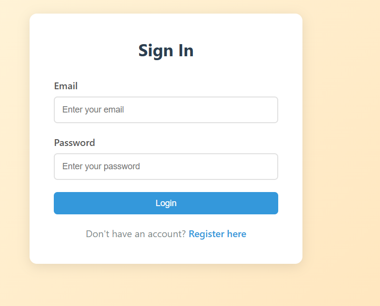
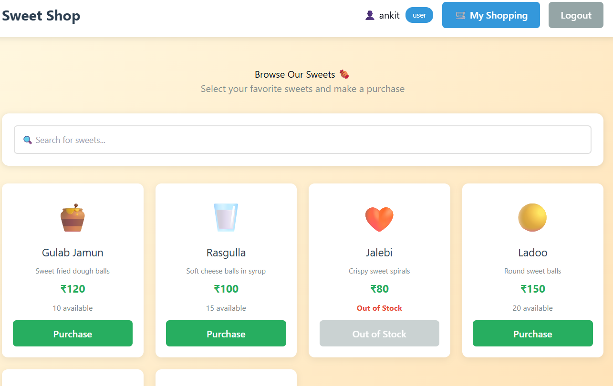
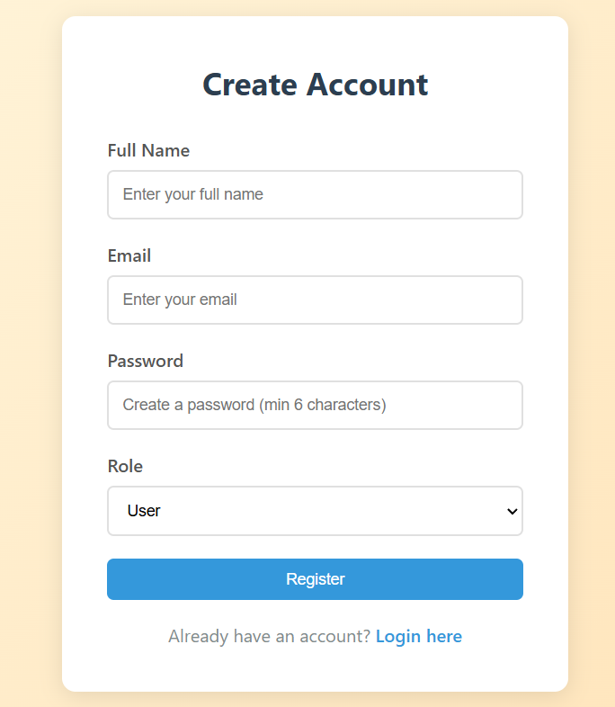

#  Sweet Shop Management System

A full-stack Sweet Shop Management System built using Django REST Framework (backend) and React + Vite (frontend). The project focuses on backend correctness, test-driven development (TDD), and clean API design, followed by frontend integration.

## Key Features

### Backend
- Custom user model with email-based authentication
- JWT-based login & registration
- Role-based access control (Admin / User)
- Sweet inventory management
- Order placement with automatic stock reduction
- Validation for insufficient stock
- Fully tested using pytest (TDD approach)

### Frontend
- User registration & login
- Sweet listing and ordering
- Admin-only sweet creation
- Axios-based API integration
- Clean and simple UI

## Tech Stack

**Backend:** Python, Django, Django REST Framework, SimpleJWT, SQLite, Pytest  
**Frontend:** React, Vite, Axios, React Router

## Running the Project Locally

### Backend

```bash
cd backend
python manage.py makemigrations
python manage.py migrate
python manage.py runserver
```

Runs at: `http://127.0.0.1:8000`

### Frontend

```bash
cd frontend
npm install
npm run dev
```

Runs at: `http://localhost:3000`

## 🔌 API Overview

| Endpoint | Method | Description |
|----------|--------|-------------|
| `/api/auth/register/` | POST | Register user |
| `/api/auth/login/` | POST | Login & get JWT |
| `/api/sweets/` | GET | List sweets |
| `/api/sweets/` | POST | Create sweet (admin) |
| `/api/orders/` | POST | Place order |
| `/api/orders/` | GET | View orders |

##  Testing

- Backend developed using Test-Driven Development (TDD)
- Tests written before implementation
- Coverage includes:
  - Authentication
  - Sweet management
  - Order logic & stock validation
- All tests pass successfully

## Screenshots

### Login Page


### Sweet List


### Registration Page


### Admin Dashboard


##  My AI Usage

### AI Tools Used
- ChatGPT (OpenAI)
- Claude (Anthropic)

### How I Used AI

#### Backend
- Core backend logic, models, API flow, and decisions were designed by me.
- AI was used to:
  - Assist in writing and refining pytest test cases
  - Review edge cases during the RED → GREEN → REFACTOR TDD cycle
  - Improve code readability during refactoring
  - Generate boilerplate code for serializers and views

#### Frontend
- AI assistance was used more heavily for:
  - React component scaffolding
  - Axios API service generation
  - Basic UI structure and styling
  - Route setup and navigation
- I manually handled:
  - API integration and error handling
  - Authentication flow and token management
  - Debugging CORS and payload mismatches
  - State management and component logic

### Reflection on AI Impact

AI significantly improved development speed, especially for repetitive and boilerplate tasks. However, I ensured that I fully understood and validated all AI-assisted code. AI acted as a supporting developer tool, while architecture, logic, testing strategy, and debugging decisions were mine. The AI helped me explore different approaches and catch potential issues early, but I made all final implementation decisions.

## Submission Explanation

This project was developed with a strong focus on backend correctness and test-driven development. I designed the data models, API structure, authentication flow, and business logic myself, following a RED → GREEN → REFACTOR TDD cycle using pytest. 

AI tools were used responsibly to assist with:
- Test scaffolding and edge case identification
- Refactoring suggestions for cleaner code
- Frontend boilerplate generation
- Documentation and code comments

All AI-assisted code was thoroughly reviewed, modified, and integrated by me to ensure correctness, clarity, and maintainability. I maintained full control over the project architecture, design decisions, and implementation strategy. The AI served as a productivity tool, not a replacement for critical thinking and problem-solving.

## Future Enhancements

- Add order history tracking
- Implement payment gateway integration
- Create admin analytics dashboard
- Add email notifications for orders
- Implement search and filter functionality
- Add unit tests for frontend components

## License

This project is created for company assessment.

---

**Developed with** **using Django, React, and AI-assisted development practices**